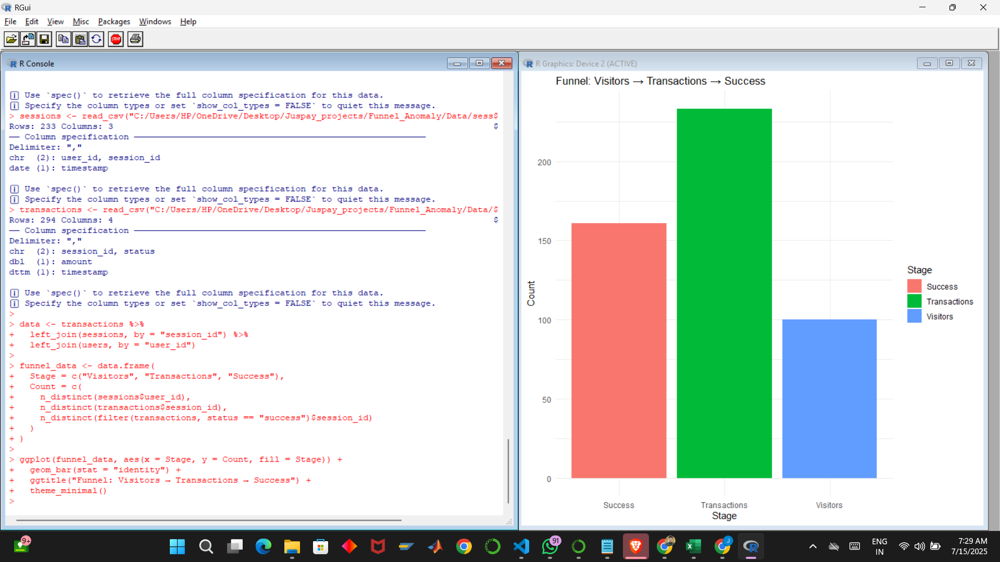
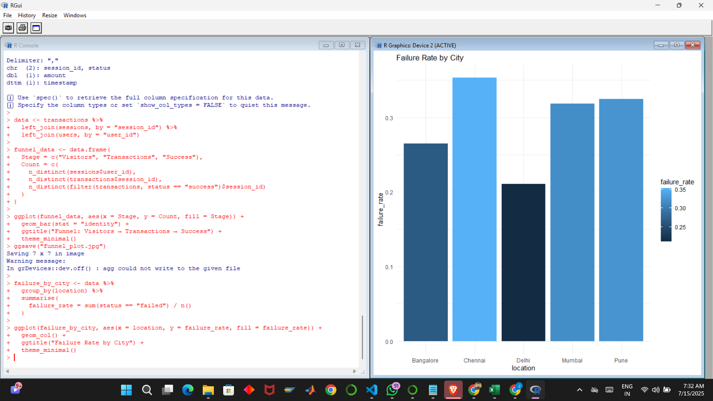
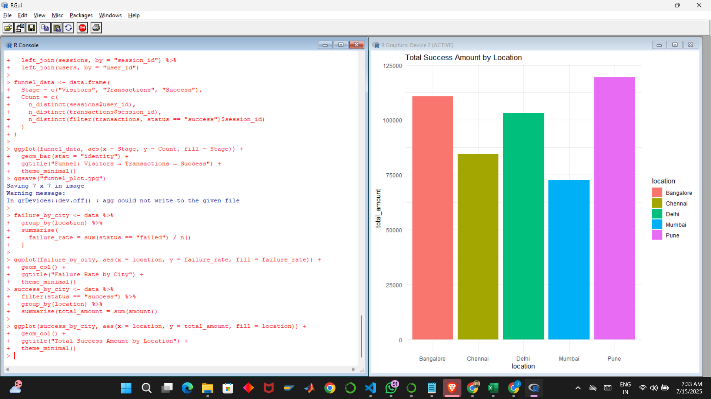
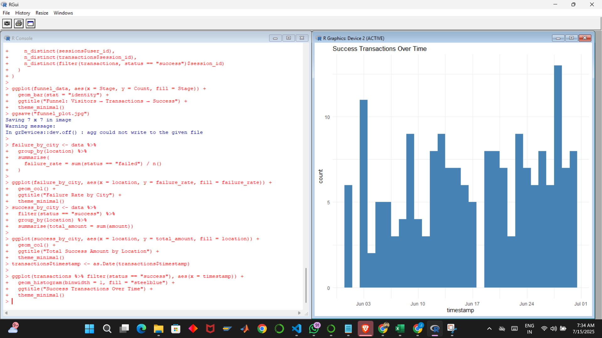

##Datasets Used

| File             | Description |
|------------------|-------------|
| `users.csv`       | User ID, signup date, and location |
| `sessions.csv`    | Session IDs per user with timestamps |
| `transactions.csv`| Amount, transaction status, and session linkage |

## SQL Analysis Highlights

Run in MySQL (via DB Fiddle):

- **Funnel Metrics**: total visitors, active sessions, successful payments  
- **Drop-offs**: failed vs abandoned transactions  
- **Anomaly Detection**:
  - Users with repeated failures
  - High-value failures over ₹4000  
- **Geo Insights**: Success and failure rates by city  

See: [`Queries.sql`](./Queries.sql)

## R-Based Visualizations

All visualizations created in [`analysis.R`](./analysis.R) using `ggplot2`.

### Funnel Bar Plot  

### Failure Rate by Location  

### Success ₹ by Location  

### Success Trend Over Time  

## Key Learnings

- Used joins and grouping to simulate funnel transitions
- Wrote anomaly detection queries using `HAVING`, `COUNT`, `JOINs`
- Learned how to structure product analytics pipelines in SQL & R
- Gained clarity on how regional issues can affect success/failure

## Tech Stack

- **SQL (MySQL)** — Funnel breakdown, user behavior & anomalies
- **R (ggplot2, dplyr)** — For data visualization
- **GitHub + VS Code** — Repo and collaboration setup

## Relevance

> Product thinking + tech skills(Data, Science, R, Sql) 
> Built for scale + investigation  
> Covers analytics, reliability & insights  
> Explains data through storytelling (like Presto tools)

---

## About Me

**Sai Bankar**  
>Final Year Mechatronics Engineering Student 
>Aspiring Product Software Engineer (PSE) @ Juspay  
[GitHub Profile](https://github.com/saibankar444)

---

> *Built from scratch. Powered by curiosity. Ready for impact.*
